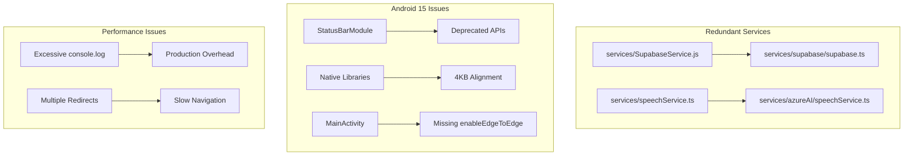
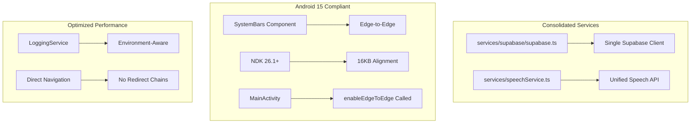
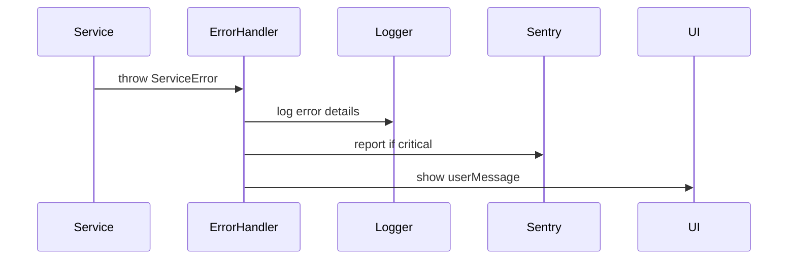

# Design Document

## Overview

This design document outlines the technical approach for implementing a comprehensive codebase optimization audit for the DukaaOn B2B marketplace app. The optimization covers four main areas:

1. **Code Quality & Redundancy Removal** - Consolidating duplicate services, removing dead code, and organizing files
2. **Performance Optimization** - Reducing bundle size, optimizing navigation, and improving logging
3. **Android 15 Compliance** - Fixing edge-to-edge display, deprecated APIs, and 16KB alignment issues
4. **Maintenance Improvements** - Standardizing error handling and organizing documentation

## Architecture

### Current State Analysis



### Target State Architecture



## Components and Interfaces

### 1. Centralized Logging Service

```typescript
interface LoggingService {
  debug(message: string, ...args: any[]): void;
  info(message: string, ...args: any[]): void;
  warn(message: string, ...args: any[]): void;
  error(message: string, error?: Error, ...args: any[]): void;
  setLogLevel(level: LogLevel): void;
}

type LogLevel = 'debug' | 'info' | 'warn' | 'error' | 'none';

interface LoggingConfig {
  level: LogLevel;
  enableInProduction: boolean;
  reportToSentry: boolean;
}
```

### 2. Android 15 Edge-to-Edge Configuration

```kotlin
// MainActivity.kt - Required structure
class MainActivity : ReactActivity() {
  override fun onCreate(savedInstanceState: Bundle?) {
    // MUST be called BEFORE super.onCreate()
    enableEdgeToEdge()
    WindowCompat.setDecorFitsSystemWindows(window, false)
    
    super.onCreate(savedInstanceState)
  }
}
```

### 3. ProGuard Rules for Deprecated API Suppression

```proguard
# Keep AndroidX edge-to-edge classes
-keep class androidx.activity.EdgeToEdge { *; }
-keep class androidx.activity.EdgeToEdgeKt { *; }
-keep class androidx.core.view.WindowCompat { *; }
-keep class androidx.core.view.WindowInsetsCompat { *; }
-keep class androidx.core.view.WindowInsetsControllerCompat { *; }

# Suppress warnings for React Native StatusBar deprecated API usage
-dontwarn com.facebook.react.modules.statusbar.StatusBarModule
-dontwarn com.facebook.react.modules.statusbar.StatusBarModule$*

# Suppress warnings for Material Design deprecated API usage
-dontwarn com.google.android.material.internal.**
```

## Data Models

### Files to Remove/Consolidate

| File | Action | Reason |
|------|--------|--------|
| `services/SupabaseService.js` | Remove | Duplicate of `services/supabase/supabase.ts` |
| `app/(main)/test.tsx` | Move to tests/ | Test file in app directory |
| `app/(main)/test-notifications.tsx` | Move to tests/ | Test file in app directory |
| `app/(main)/auth sample` | Remove | Sample/backup file |
| `app/(auth)/handle_firebase_auth.sql` | Move to sql/ | SQL file in wrong location |

### Android Configuration Changes

| File | Change | Purpose |
|------|--------|---------|
| `android/app/proguard-rules.pro` | Add edge-to-edge rules | Suppress deprecated API warnings |
| `android/gradle.properties` | Verify 16KB settings | Ensure proper alignment |
| `android/app/build.gradle` | Verify NDK version | 16KB page size support |
| `app.plugin.js` | Fix MainActivity generation | Ensure enableEdgeToEdge() is called |

## Correctness Properties

*A property is a characteristic or behavior that should hold true across all valid executions of a system-essentially, a formal statement about what the system should do. Properties serve as the bridge between human-readable specifications and machine-verifiable correctness guarantees.*

### Property 1: Production Logging Suppression
*For any* log call made through the LoggingService in production mode with log level set to 'error', debug and info level logs SHALL NOT be output to the console.
**Validates: Requirements 2.1**

### Property 2: Navigation Redirect Minimization
*For any* navigation from the app entry point (index.tsx) to the home screen, the navigation path SHALL contain at most 2 intermediate screens (redirects).
**Validates: Requirements 5.1**

### Property 3: Data Fetch Deduplication
*For any* screen component that mounts when data already exists in the global state, the component SHALL NOT trigger a new network fetch for that data.
**Validates: Requirements 5.2**

### Property 4: Auth Initialization Efficiency
*For any* app cold start with valid cached authentication, the auth store SHALL perform at most one session validation check before allowing navigation.
**Validates: Requirements 7.1**

## Error Handling

### Standardized Error Pattern

```typescript
interface AppError {
  code: string;
  message: string;
  userMessage: string;
  originalError?: Error;
  context?: Record<string, any>;
}

class ServiceError extends Error implements AppError {
  code: string;
  userMessage: string;
  originalError?: Error;
  context?: Record<string, any>;
  
  constructor(code: string, message: string, userMessage: string, originalError?: Error) {
    super(message);
    this.code = code;
    this.userMessage = userMessage;
    this.originalError = originalError;
  }
}
```

### Error Handling Flow



## Testing Strategy

### Unit Testing
- Test LoggingService log level filtering
- Test error handling patterns
- Test navigation path calculation

### Property-Based Testing
Using `fast-check` library for property-based tests:

- **Logging Properties**: Generate random log calls, verify filtering by environment
- **Navigation Properties**: Generate navigation scenarios, verify redirect count
- **Data Fetch Properties**: Generate state scenarios, verify fetch deduplication

Each property-based test SHALL:
1. Run minimum 100 iterations
2. Be tagged with the property number from this design document
3. Use format: `**Feature: codebase-optimization-audit, Property {number}: {property_text}**`

## Android 15 Implementation Details

### Edge-to-Edge Fix Strategy

The Google Play Console warnings persist because:

1. **React Native's StatusBarModule** - This module internally calls `Window.setStatusBarColor()` and `Window.setNavigationBarColor()`. We cannot modify React Native core, so we must:
   - Add ProGuard rules to suppress these warnings
   - Use `react-native-edge-to-edge`'s `SystemBars` component instead of React Native's `StatusBar`

2. **Material Design Components** - Google's Material library uses deprecated APIs internally. We must:
   - Add ProGuard rules to suppress warnings from `com.google.android.material.internal`

3. **MainActivity.kt Generation** - The `enableEdgeToEdge()` call must happen BEFORE `super.onCreate()`. The current plugin may not be generating this correctly.

### 16KB Alignment Fix Strategy

The 16KB alignment warnings persist because:

1. **NDK Version** - Must use NDK 26.1.10909125 or higher
2. **Packaging Options** - Must set `useLegacyPackaging = false`
3. **Gradle Properties** - Must have:
   ```properties
   android.enableNativeLibraryAlignment=true
   android.bundle.nativeLibsAlignment=16384
   ```

### ProGuard Rules to Add

```proguard
# ============================================
# Android 15 Edge-to-Edge Compatibility
# ============================================

# Keep AndroidX edge-to-edge classes (required for enableEdgeToEdge())
-keep class androidx.activity.EdgeToEdge { *; }
-keep class androidx.activity.EdgeToEdgeKt { *; }
-keep class androidx.activity.ComponentActivity { *; }
-keep class androidx.core.view.WindowCompat { *; }
-keep class androidx.core.view.WindowInsetsCompat { *; }
-keep class androidx.core.view.WindowInsetsCompat$* { *; }
-keep class androidx.core.view.WindowInsetsControllerCompat { *; }

# ============================================
# Suppress Deprecated API Warnings
# ============================================

# React Native StatusBar module uses deprecated Window APIs
# These cannot be fixed without modifying React Native core
-dontwarn com.facebook.react.modules.statusbar.StatusBarModule
-dontwarn com.facebook.react.modules.statusbar.StatusBarModule$*

# Material Design components use deprecated APIs internally
-dontwarn com.google.android.material.internal.**
-dontwarn com.google.android.material.internal.d
-dontwarn com.google.android.material.internal.c

# Suppress warnings for deprecated Window methods
-dontwarn android.view.Window
```

### MainActivity.kt Template

The plugin should generate this exact structure:

```kotlin
package com.sixn8.dukaaon

import android.os.Bundle
import androidx.activity.enableEdgeToEdge
import androidx.core.view.WindowCompat
import com.facebook.react.ReactActivity
import com.facebook.react.ReactActivityDelegate
import com.facebook.react.defaults.DefaultNewArchitectureEntryPoint.fabricEnabled
import com.facebook.react.defaults.DefaultReactActivityDelegate

class MainActivity : ReactActivity() {
  override fun getMainComponentName(): String = "main"

  override fun createReactActivityDelegate(): ReactActivityDelegate =
      DefaultReactActivityDelegate(this, mainComponentName, fabricEnabled)

  override fun onCreate(savedInstanceState: Bundle?) {
    // CRITICAL: These MUST be called BEFORE super.onCreate()
    enableEdgeToEdge()
    WindowCompat.setDecorFitsSystemWindows(window, false)
    
    super.onCreate(savedInstanceState)
  }
}
```

## File Organization Plan

### Files to Create
- `services/logging/LoggingService.ts` - Centralized logging
- `services/errors/ServiceError.ts` - Standardized error class
- `docs/architecture/` - Architecture documentation
- `docs/guides/` - Developer guides

### Files to Remove
- `services/SupabaseService.js` - After updating all imports
- `app/(main)/auth sample` - Backup file
- Empty directories in `services/`

### Files to Move
- `app/(main)/test*.tsx` → `tests/integration/`
- `app/(auth)/*.sql` → `sql/`
- Root `.md` files → `docs/`
