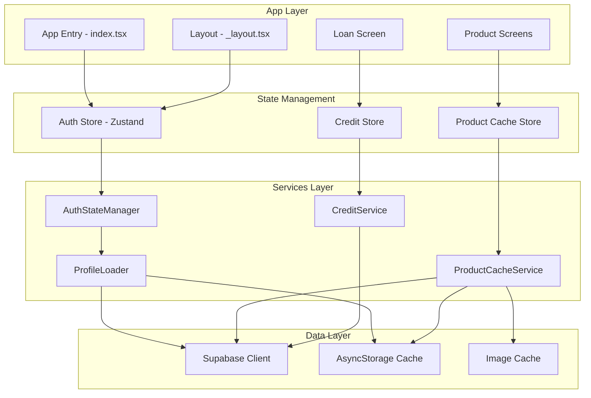
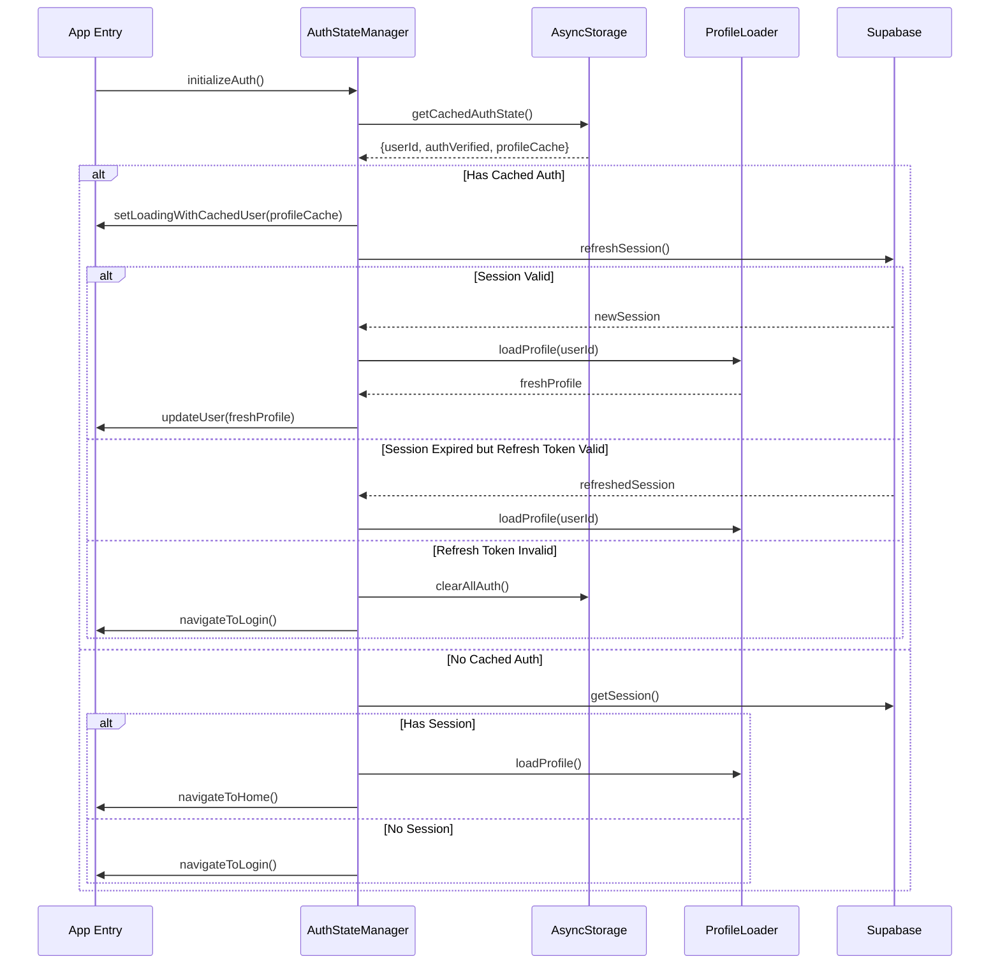

# Design Document

## Overview

This design document outlines the technical approach for implementing four critical improvements to the DukaaOn B2B marketplace app:

1. **Profile Loading Fix** - A complete overhaul of the authentication state management to ensure reliable session restoration on cold starts
2. **Product Screen Performance** - Implementing caching, skeleton loading, and optimized queries for fast product rendering
3. **Product Variants System** - Database schema extensions and UI components for managing product variants
4. **Credit/Loan Payment System** - NBFC-integrated credit facility with KYC and UPI autopay

## Architecture

### High-Level Architecture



### Authentication State Flow (Cold Start)



## Components and Interfaces

### 1. AuthStateManager (New Service)

```typescript
interface AuthStateManager {
  // Single entry point for auth initialization
  initializeAuth(): Promise<AuthResult>;
  
  // Coordinates all auth state checks
  getAuthState(): Promise<AuthState>;
  
  // Handles session refresh with proper error handling
  refreshSession(): Promise<SessionResult>;
  
  // Prevents race conditions with mutex lock
  acquireAuthLock(): Promise<boolean>;
  releaseAuthLock(): void;
}

interface AuthState {
  isAuthenticated: boolean;
  user: Profile | null;
  session: Session | null;
  source: 'cache' | 'network' | 'none';
  needsRefresh: boolean;
}

interface AuthResult {
  success: boolean;
  navigateTo: 'home' | 'login' | 'onboarding';
  user?: Profile;
  error?: string;
}
```

### 2. ProductCacheService (New Service)

```typescript
interface ProductCacheService {
  // Get products with cache-first strategy
  getProducts(options: ProductQueryOptions): Promise<CachedProductResult>;
  
  // Pre-fetch products for a seller
  prefetchSellerProducts(sellerId: string): void;
  
  // Get cached products immediately
  getCachedProducts(key: string): Product[] | null;
  
  // Invalidate cache for specific queries
  invalidateCache(pattern: string): void;
}

interface ProductQueryOptions {
  categoryId?: string;
  sellerId?: string;
  searchTerm?: string;
  limit?: number;
  offset?: number;
  networkQuality?: 'fast' | 'slow' | 'offline';
}

interface CachedProductResult {
  products: Product[];
  fromCache: boolean;
  isStale: boolean;
  totalCount: number;
}
```

### 3. Product Variants Interface

```typescript
interface ProductVariant {
  id: string;
  product_id: string;  // Parent product reference
  sku: string;
  variant_type: 'size' | 'flavor' | 'color' | 'weight' | 'pack';
  variant_value: string;  // e.g., "500ml", "Chocolate"
  price: number;
  mrp?: number;
  stock_quantity: number;
  image_url?: string;
  is_default: boolean;
  display_order: number;
  is_active: boolean;
}

interface ProductWithVariants extends Product {
  variants: ProductVariant[];
  variant_groups: VariantGroup[];
  default_variant_id?: string;
}

interface VariantGroup {
  type: 'size' | 'flavor' | 'color' | 'weight' | 'pack';
  display_name: string;  // e.g., "Size", "Flavor"
  values: string[];  // e.g., ["220ml", "500ml", "1L", "2L"]
}
```

### 4. Credit System Interfaces

```typescript
interface CreditFacility {
  id: string;
  retailer_id: string;
  credit_limit: number;
  available_credit: number;
  kyc_status: 'pending' | 'verified' | 'rejected';
  kyc_rejection_reason?: string;
  created_at: string;
}

interface CreditPayment {
  id: string;
  retailer_id: string;
  wholesaler_id: string;
  amount: number;
  repayment_period: 'daily' | 'weekly' | 'monthly';
  repayment_days: number;
  interest_rate: number;
  total_repayment: number;
  emi_amount: number;
  mandate_id?: string;
  status: 'pending_mandate' | 'active' | 'completed' | 'defaulted';
  created_at: string;
}

interface UPIMandate {
  id: string;
  credit_payment_id: string;
  mandate_urn: string;
  frequency: 'daily' | 'weekly' | 'monthly';
  amount: number;
  start_date: string;
  end_date: string;
  status: 'pending' | 'active' | 'paused' | 'cancelled';
}
```

## Data Models

### Database Schema Changes

#### 1. Product Variants Table (New - Additive)

```sql
-- New table for product variants - does not modify existing products table
CREATE TABLE IF NOT EXISTS public.product_variants (
    id UUID PRIMARY KEY DEFAULT gen_random_uuid(),
    product_id UUID NOT NULL REFERENCES products(id) ON DELETE CASCADE,
    sku VARCHAR(100) NOT NULL,
    variant_type TEXT NOT NULL CHECK (variant_type IN ('size', 'flavor', 'color', 'weight', 'pack')),
    variant_value TEXT NOT NULL,
    price DECIMAL(10,2) NOT NULL CHECK (price >= 0),
    mrp DECIMAL(10,2),
    stock_quantity INTEGER DEFAULT 0 CHECK (stock_quantity >= 0),
    image_url TEXT,
    is_default BOOLEAN DEFAULT false,
    display_order INTEGER DEFAULT 0,
    is_active BOOLEAN DEFAULT true,
    created_at TIMESTAMP WITH TIME ZONE DEFAULT NOW(),
    updated_at TIMESTAMP WITH TIME ZONE DEFAULT NOW(),
    
    UNIQUE(product_id, sku),
    UNIQUE(product_id, variant_type, variant_value)
);

-- Indexes for performance
CREATE INDEX idx_product_variants_product_id ON product_variants(product_id);
CREATE INDEX idx_product_variants_sku ON product_variants(sku);
CREATE INDEX idx_product_variants_type ON product_variants(variant_type);
CREATE INDEX idx_product_variants_active ON product_variants(is_active) WHERE is_active = true;
```

#### 2. Products Table Extension (Additive Only)

```sql
-- Add new columns to existing products table - NO modifications to existing columns
ALTER TABLE products ADD COLUMN IF NOT EXISTS has_variants BOOLEAN DEFAULT false;
ALTER TABLE products ADD COLUMN IF NOT EXISTS variant_display_type TEXT DEFAULT 'grouped' 
    CHECK (variant_display_type IN ('grouped', 'separate'));
ALTER TABLE products ADD COLUMN IF NOT EXISTS parent_product_id UUID REFERENCES products(id);

-- Index for variant queries
CREATE INDEX IF NOT EXISTS idx_products_has_variants ON products(has_variants) WHERE has_variants = true;
CREATE INDEX IF NOT EXISTS idx_products_parent ON products(parent_product_id) WHERE parent_product_id IS NOT NULL;
```

#### 3. Credit System Tables (New)

```sql
-- Credit facility for retailers
CREATE TABLE IF NOT EXISTS public.credit_facilities (
    id UUID PRIMARY KEY DEFAULT gen_random_uuid(),
    retailer_id UUID NOT NULL REFERENCES profiles(id) ON DELETE CASCADE,
    credit_limit DECIMAL(12,2) NOT NULL DEFAULT 0,
    available_credit DECIMAL(12,2) NOT NULL DEFAULT 0,
    kyc_status TEXT DEFAULT 'pending' CHECK (kyc_status IN ('pending', 'verified', 'rejected')),
    kyc_rejection_reason TEXT,
    kyc_verified_at TIMESTAMP WITH TIME ZONE,
    nbfc_customer_id TEXT,
    created_at TIMESTAMP WITH TIME ZONE DEFAULT NOW(),
    updated_at TIMESTAMP WITH TIME ZONE DEFAULT NOW(),
    
    UNIQUE(retailer_id)
);

-- Credit payments to wholesalers
CREATE TABLE IF NOT EXISTS public.credit_payments (
    id UUID PRIMARY KEY DEFAULT gen_random_uuid(),
    retailer_id UUID NOT NULL REFERENCES profiles(id),
    wholesaler_id UUID NOT NULL REFERENCES profiles(id),
    amount DECIMAL(12,2) NOT NULL CHECK (amount > 0),
    repayment_period TEXT NOT NULL CHECK (repayment_period IN ('daily', 'weekly', 'monthly')),
    repayment_days INTEGER NOT NULL,
    interest_rate DECIMAL(5,2) NOT NULL,
    processing_fee DECIMAL(5,2) DEFAULT 2.0,
    total_repayment DECIMAL(12,2) NOT NULL,
    emi_amount DECIMAL(12,2) NOT NULL,
    outstanding_amount DECIMAL(12,2) NOT NULL,
    next_payment_date DATE,
    status TEXT DEFAULT 'pending_mandate' 
        CHECK (status IN ('pending_mandate', 'active', 'completed', 'defaulted')),
    created_at TIMESTAMP WITH TIME ZONE DEFAULT NOW(),
    updated_at TIMESTAMP WITH TIME ZONE DEFAULT NOW()
);

-- UPI Autopay mandates
CREATE TABLE IF NOT EXISTS public.upi_mandates (
    id UUID PRIMARY KEY DEFAULT gen_random_uuid(),
    credit_payment_id UUID NOT NULL REFERENCES credit_payments(id),
    mandate_urn TEXT,
    upi_id TEXT NOT NULL,
    frequency TEXT NOT NULL CHECK (frequency IN ('daily', 'weekly', 'monthly')),
    amount DECIMAL(12,2) NOT NULL,
    start_date DATE NOT NULL,
    end_date DATE NOT NULL,
    status TEXT DEFAULT 'pending' CHECK (status IN ('pending', 'active', 'paused', 'cancelled', 'expired')),
    created_at TIMESTAMP WITH TIME ZONE DEFAULT NOW(),
    updated_at TIMESTAMP WITH TIME ZONE DEFAULT NOW()
);

-- Payment history
CREATE TABLE IF NOT EXISTS public.credit_payment_history (
    id UUID PRIMARY KEY DEFAULT gen_random_uuid(),
    credit_payment_id UUID NOT NULL REFERENCES credit_payments(id),
    amount DECIMAL(12,2) NOT NULL,
    payment_date TIMESTAMP WITH TIME ZONE DEFAULT NOW(),
    payment_method TEXT DEFAULT 'upi_mandate',
    transaction_id TEXT,
    status TEXT DEFAULT 'success' CHECK (status IN ('success', 'failed', 'pending')),
    created_at TIMESTAMP WITH TIME ZONE DEFAULT NOW()
);
```

## Correctness Properties

*A property is a characteristic or behavior that should hold true across all valid executions of a system-essentially, a formal statement about what the system should do. Properties serve as the bridge between human-readable specifications and machine-verifiable correctness guarantees.*

### Property 1: Cold Start Session Restoration
*For any* user with valid cached authentication data (auth_verified=true, user_id present), when the app performs a cold start, the user SHALL be navigated to the home screen (not login) within 5 seconds, regardless of network conditions.
**Validates: Requirements 1.1, 1.3**

### Property 2: Session Refresh Before Profile Fetch
*For any* cold start where the Supabase session token has expired, the system SHALL attempt session refresh using the refresh token BEFORE attempting any profile database queries.
**Validates: Requirements 1.2**

### Property 3: Retry with Exponential Backoff
*For any* profile fetch failure, the system SHALL retry exactly 3 times with delays of 1s, 2s, and 4s (exponential backoff) before falling back to cached data.
**Validates: Requirements 1.4**

### Property 4: Invalid Token Cleanup
*For any* authentication attempt where the refresh token is invalid or expired, the system SHALL clear ALL cached authentication data (auth_verified, user_id, profile_id, profile_cache_*) before navigating to login.
**Validates: Requirements 1.5**

### Property 5: Background Refresh After Cache Load
*For any* successful profile load from cache, the system SHALL initiate a background refresh within 100ms that does not block the UI or navigation.
**Validates: Requirements 1.6**

### Property 6: Race Condition Prevention
*For any* concurrent authentication state checks during cold start, the final navigation decision SHALL be consistent and deterministic (same cached state always produces same navigation).
**Validates: Requirements 1.7**

### Property 7: Skeleton Loading Timing
*For any* products screen or category screen open, skeleton placeholders SHALL be visible within 100ms of navigation start, before any network request completes.
**Validates: Requirements 2.1**

### Property 8: Cache-First Product Loading
*For any* product query where cached data exists, the cached products SHALL be displayed first, and fresh data SHALL update the display without full re-render.
**Validates: Requirements 2.2, 2.6**

### Property 9: Adaptive Batch Sizing
*For any* product fetch on slow network (2G/3G), the initial batch size SHALL be reduced to at most 10 items (vs 50 on fast network).
**Validates: Requirements 2.5**

### Property 10: Variant Grouping Consistency
*For any* product with size/weight variants, all variants SHALL be displayed within a single product card, and selecting a variant SHALL update price, stock, and image atomically.
**Validates: Requirements 3.1, 3.3**

### Property 11: Flavor Variant Separation
*For any* product with flavor variants, each flavor SHALL appear as a separate product card in the products list, while size variants within each flavor are grouped.
**Validates: Requirements 3.8**

### Property 12: Backward Compatibility
*For any* existing product without variants (has_variants=false or null), the product SHALL render identically to the current implementation without variant selectors.
**Validates: Requirements 3.10, 3.11**

### Property 13: Cart Variant Recording
*For any* product with variants added to cart, the cart item SHALL contain the specific variant_id and SKU, and display the variant details (e.g., "Mirinda 500ml").
**Validates: Requirements 3.6**

### Property 14: Interest Calculation Accuracy
*For any* credit payment, the calculated interest SHALL match the formula: `totalInterest = (principal * rate * days) / (100 * 365)` where rate varies by repayment period.
**Validates: Requirements 4.3, 4.10**

### Property 15: KYC Gate Enforcement
*For any* credit facility access attempt where kyc_status != 'verified', the system SHALL redirect to KYC flow and block payment initiation.
**Validates: Requirements 4.4, 4.9**

### Property 16: Credit Payment Flow Integrity
*For any* confirmed credit payment, the system SHALL: (1) create UPI mandate, (2) wait for mandate success, (3) process payment to wholesaler, (4) create credit record - in that exact order.
**Validates: Requirements 4.6, 4.7**

## Error Handling

### Authentication Errors
- **Network Timeout**: Use cached profile, show offline indicator, retry in background
- **Invalid Refresh Token**: Clear all auth data, navigate to login with "Session expired" message
- **Profile Not Found**: Clear auth data, navigate to onboarding flow
- **Concurrent Auth Checks**: Use mutex lock to serialize, return cached result for subsequent calls

### Product Loading Errors
- **Network Failure**: Show cached products with "Offline" badge, disable refresh
- **Empty Results**: Show "No products found" with retry button
- **Partial Load Failure**: Show loaded products, indicate incomplete load

### Credit System Errors
- **KYC Verification Failed**: Show rejection reason, provide resubmission option
- **Mandate Setup Failed**: Allow retry, show UPI app troubleshooting
- **Payment Processing Failed**: Rollback credit record, notify user, allow retry

## Testing Strategy

### Unit Testing
- Test AuthStateManager state transitions
- Test ProductCacheService cache hit/miss logic
- Test interest calculation functions
- Test variant grouping logic

### Property-Based Testing
Using `fast-check` library for property-based tests:

- **Auth Properties**: Generate random cached auth states, verify navigation consistency
- **Product Cache Properties**: Generate random product sets, verify cache-first behavior
- **Variant Properties**: Generate products with various variant configurations, verify grouping rules
- **Credit Properties**: Generate random payment amounts and periods, verify interest calculations

Each property-based test SHALL:
1. Run minimum 100 iterations
2. Be tagged with the property number from this design document
3. Use format: `**Feature: dukaaon-app-improvements, Property {number}: {property_text}**`
