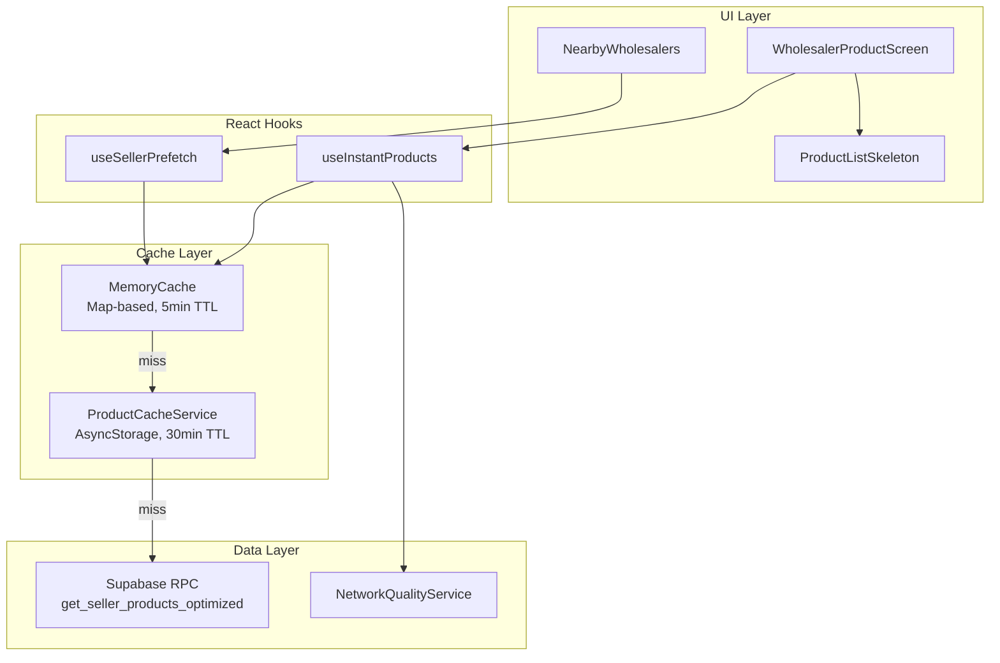
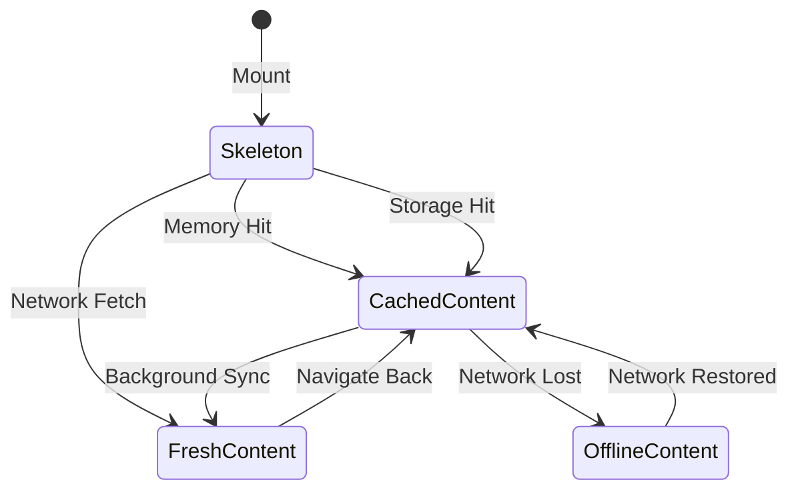

# Design Document: Fast Product Loading System

## Overview

This design enhances the DukaaOn app's product loading system to achieve instant product display by integrating the existing `ProductCacheService` into the retailer-facing wholesaler product screens, adding a memory cache layer, and implementing predictive prefetching. The goal is to achieve sub-100ms perceived loading times similar to major e-commerce apps.

### Current State
- Skeleton loading components exist (`ProductCardSkeleton`, `CategoryScreenSkeleton`, `ProductListSkeleton`)
- `ProductCacheService` implements stale-while-revalidate with AsyncStorage
- Optimized RPC functions exist (`get_seller_products_optimized`)
- `retailer/wholesaler/[id].tsx` fetches directly from Supabase (bypassing cache)

### Target State
- All product screens use `ProductCacheService` with memory cache layer
- Products prefetched when wholesaler cards become visible
- Instant render from memory cache, background refresh for freshness

## Architecture



## Components and Interfaces

### 1. MemoryCacheService

A new in-memory cache layer that provides synchronous access to recently fetched data.

```typescript
// services/cache/MemoryCacheService.ts

interface MemoryCacheEntry<T> {
  data: T;
  timestamp: number;
  accessTime: number;
}

interface MemoryCacheConfig {
  maxEntries: number;      // Default: 100
  ttlMs: number;           // Default: 5 * 60 * 1000 (5 minutes)
  backgroundClearMs: number; // Default: 10 * 60 * 1000 (10 minutes)
}

class MemoryCacheService<T> {
  private cache: Map<string, MemoryCacheEntry<T>>;
  private config: MemoryCacheConfig;
  private lastActiveTime: number;
  
  // Synchronous get - returns immediately
  get(key: string): T | null;
  
  // Set with automatic LRU eviction
  set(key: string, data: T): void;
  
  // Check if key exists and is not expired
  has(key: string): boolean;
  
  // Clear all entries
  clear(): void;
  
  // Handle app state changes
  onAppStateChange(state: 'active' | 'background'): void;
  
  // Evict LRU entries when over capacity
  private evictLRU(): void;
}
```

### 2. useInstantProducts Hook

A new hook that provides instant product loading with the cache-first strategy.

```typescript
// hooks/useInstantProducts.ts

interface UseInstantProductsOptions {
  sellerId: string;
  categoryFilter?: string;
  searchTerm?: string;
  pageSize?: number;
}

interface UseInstantProductsResult {
  products: Product[];
  isLoading: boolean;           // True only on cold cache
  isRefreshing: boolean;        // True during background refresh
  hasMore: boolean;
  error: string | null;
  loadMore: () => void;
  refresh: () => void;
  cacheStatus: 'memory' | 'storage' | 'network' | 'none';
}

function useInstantProducts(options: UseInstantProductsOptions): UseInstantProductsResult;
```

### 3. Enhanced ProductCacheService

Extend existing service to integrate with memory cache.

```typescript
// services/products/ProductCacheService.ts (modifications)

class ProductCacheServiceClass {
  // NEW: Memory cache integration
  private memoryCache: MemoryCacheService<CachedProductResult>;
  
  // NEW: Get from memory cache first (synchronous)
  getFromMemory(cacheKey: string): CachedProductResult | null;
  
  // MODIFIED: Check memory -> AsyncStorage -> Network
  async getProducts(options: ProductQueryOptions): Promise<CachedProductResult>;
  
  // NEW: Update both caches after fetch
  private async updateCaches(
    cacheKey: string, 
    result: CachedProductResult
  ): Promise<void>;
  
  // NEW: Warm memory cache from AsyncStorage
  async warmCache(sellerIds: string[]): Promise<void>;
}
```

### 4. PrefetchManager

Manages prefetch queue with priority and cancellation.

```typescript
// services/products/PrefetchManager.ts

interface PrefetchRequest {
  sellerId: string;
  priority: 'low' | 'high';
  timestamp: number;
  abortController: AbortController;
}

class PrefetchManager {
  private queue: Map<string, PrefetchRequest>;
  private maxQueueSize: number = 3;
  
  // Add to prefetch queue
  prefetch(sellerId: string, priority?: 'low' | 'high'): void;
  
  // Cancel prefetch for seller
  cancel(sellerId: string): void;
  
  // Cancel all pending prefetches
  cancelAll(): void;
  
  // Check if prefetch is in progress
  isPrefetching(sellerId: string): boolean;
}
```

### 5. Enhanced useSellerPrefetch Hook

Extend existing hook to use PrefetchManager.

```typescript
// hooks/useSellerPrefetch.ts (modifications)

interface UseSellerPrefetchResult {
  // Existing
  onSellerFocus: (sellerId: string) => void;
  onSellerBlur: (sellerId: string) => void;
  prefetchSeller: (sellerId: string) => void;
  cancelPrefetch: (sellerId: string) => void;
  
  // NEW
  prefetchVisible: (sellerIds: string[]) => void;
  onLongPress: (sellerId: string) => void;
}
```

## Data Models

### CacheKey Structure

```typescript
// Cache key format for consistent lookup
type CacheKey = `seller_${string}_page_${number}_filter_${string}`;

function generateCacheKey(
  sellerId: string, 
  page: number = 0, 
  filter: string = 'all'
): CacheKey {
  return `seller_${sellerId}_page_${page}_filter_${filter}`;
}
```

### Performance Metrics

```typescript
interface LoadingMetrics {
  navigationStart: number;
  skeletonRender: number;
  firstContentRender: number;
  interactiveTime: number;
  cacheType: 'memory' | 'storage' | 'network';
  productCount: number;
}
```

## Correctness Properties

*A property is a characteristic or behavior that should hold true across all valid executions of a system-essentially, a formal statement about what the system should do. Properties serve as the bridge between human-readable specifications and machine-verifiable correctness guarantees.*

### Property 1: Immediate Skeleton Render
*For any* navigation to WholesalerProductScreen, the skeleton UI should render within 16ms (one frame) of component mount, regardless of cache state or network conditions.
**Validates: Requirements 1.1, 6.1**

### Property 2: Cache-First Data Return
*For any* product fetch request where memory cache has valid data, the system should return that data synchronously without awaiting AsyncStorage or network calls.
**Validates: Requirements 1.2, 2.2, 2.3**

### Property 3: Memory Cache LRU Eviction
*For any* memory cache with 100 entries, adding a new entry should evict the least-recently-accessed entry, maintaining the cache size at or below 100 entries.
**Validates: Requirements 2.4**

### Property 4: Prefetch Queue Management
*For any* prefetch queue with 3 pending requests, adding a new low-priority request should cancel the oldest low-priority request, maintaining queue size at or below 3.
**Validates: Requirements 3.4**

### Property 5: Network-Adaptive Prefetch
*For any* slow network condition (2G/3G), automatic prefetching should be disabled, and only explicit user-triggered prefetches (long-press) should execute.
**Validates: Requirements 3.5, 5.4**

### Property 6: Background Sync Non-Blocking
*For any* background sync operation, the UI should remain responsive (no frame drops) and cached data should continue to be displayed during the sync.
**Validates: Requirements 4.1**

### Property 7: Dual Cache Update
*For any* successful network fetch, both memory cache and AsyncStorage cache should be updated with the same data and timestamp.
**Validates: Requirements 4.4**

### Property 8: Exponential Backoff Retry
*For any* failed background sync, retries should follow exponential backoff (1s, 2s, 4s) with a maximum of 3 attempts before giving up.
**Validates: Requirements 4.5**

### Property 9: Critical Data Selection
*For any* prefetch or initial fetch operation, only critical fields (id, name, price, image_url, min_quantity, unit, seller_id) should be requested from the database.
**Validates: Requirements 3.3, 5.2**

### Property 10: Offline Cache Serving
*For any* offline state, the system should serve all available cached data without making network requests, and should not show error states if cache has data.
**Validates: Requirements 1.5, 5.5**

### Property 11: Performance Metric Logging
*For any* product load operation, the system should log time-to-first-content and time-to-interactive metrics with cache type information.
**Validates: Requirements 7.1, 7.2, 7.3**

### Property 12: Cache Warming on Startup
*For any* app startup, the memory cache should be warmed with data from AsyncStorage for the 5 most recently viewed wholesalers.
**Validates: Requirements 7.5**

## Error Handling

### Network Failures
1. **During Initial Load**: Show skeleton, then cached data if available, with offline indicator
2. **During Background Sync**: Silently retry with exponential backoff, log warning after 3 failures
3. **During Prefetch**: Cancel silently, do not show error to user

### Cache Failures
1. **Memory Cache Full**: Evict LRU entries automatically
2. **AsyncStorage Error**: Fall back to network, log error
3. **Corrupted Cache Data**: Clear corrupted entry, fetch fresh data

### State Transitions



## Testing Strategy

### Dual Testing Approach

This feature requires both unit tests and property-based tests:

- **Unit tests**: Verify specific examples, edge cases, and integration points
- **Property-based tests**: Verify universal properties hold across all inputs

### Property-Based Testing Framework

We will use **fast-check** for property-based testing in TypeScript/JavaScript.

```typescript
import fc from 'fast-check';
```

### Test Categories

#### 1. Memory Cache Tests
- Property tests for LRU eviction behavior
- Property tests for TTL expiration
- Unit tests for edge cases (empty cache, single entry)

#### 2. Cache Integration Tests
- Property tests for cache lookup order (memory → storage → network)
- Property tests for dual cache updates
- Unit tests for cache key generation

#### 3. Prefetch Tests
- Property tests for queue management
- Property tests for network-adaptive behavior
- Unit tests for priority handling

#### 4. Performance Tests
- Property tests for timing constraints
- Unit tests for metric logging

### Test Annotations

Each property-based test MUST be annotated with:
```typescript
/**
 * **Feature: fast-product-loading, Property {number}: {property_text}**
 * **Validates: Requirements {X.Y}**
 */
```

### Minimum Iterations

Each property-based test should run a minimum of 100 iterations to ensure adequate coverage of the input space.

