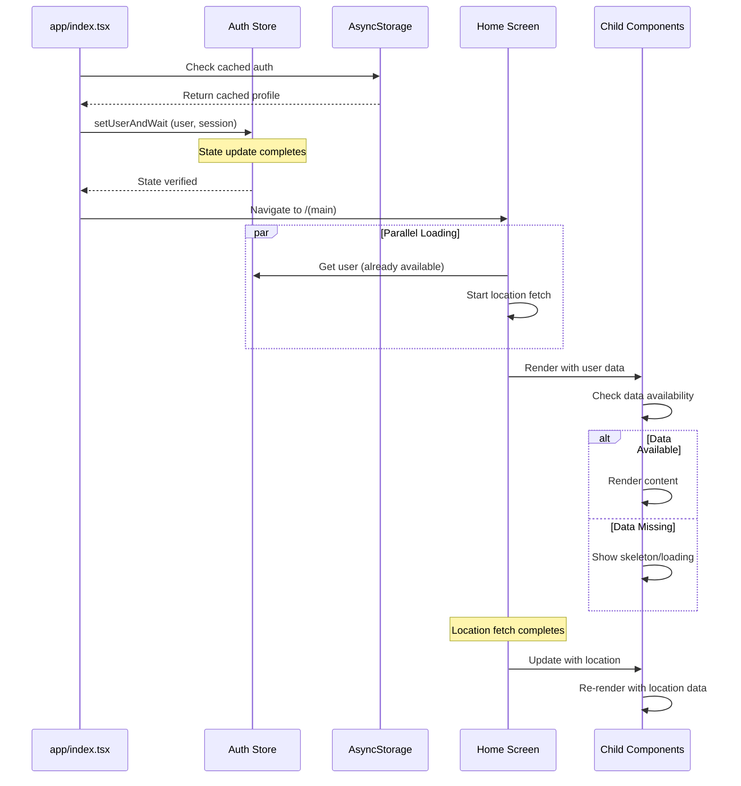

# Design Document: Fix Home Screen Loading State

## Overview

This design addresses multiple loading issues causing poor user experience on app startup:
1. Race condition between navigation and auth state propagation
2. Sequential loading of profile and location data causing delays
3. Components mounting before required data is available
4. Missing error boundaries causing blank screens

The solution implements:
1. Synchronized navigation pattern with verified state propagation
2. Parallel data loading for profile and location
3. Defensive component rendering with data availability checks
4. Error boundaries for graceful degradation
5. Stale-while-revalidate caching for instant perceived performance

## Architecture



## Components and Interfaces

### 1. Enhanced Index Screen (`app/index.tsx`)

The index screen will be modified to ensure state updates complete before navigation:

```typescript
interface NavigationGuard {
  ensureUserLoaded: () => Promise<boolean>;
  navigateWithUser: (path: string) => Promise<void>;
}
```

Key changes:
- Use `await` to ensure `useAuthStore.setState()` completes
- Add a small delay after state update to allow React to process
- Verify user is in store before calling `router.replace()`

### 2. Enhanced Home Screen (`app/(main)/home/index.tsx`)

The home screen will be modified to handle the case where user might not be immediately available:

```typescript
interface HomeScreenState {
  isLoading: boolean;
  hasTimedOut: boolean;
  retryCount: number;
}
```

Key changes:
- Subscribe to auth store changes reactively
- Use `useEffect` to watch for user becoming available
- Implement timeout with retry option
- Skip redundant loading if user already exists

### 3. Auth Store Synchronization Helper

New utility to ensure state propagation:

```typescript
// utils/authSync.ts
export const waitForAuthState = async (
  predicate: () => boolean,
  timeout: number = 5000
): Promise<boolean>;

export const setUserAndWait = async (
  user: Profile,
  session: any
): Promise<void>;
```

### 4. Parallel Data Loading

The home screen currently loads data sequentially:
1. Wait for user
2. Then fetch location
3. Then render components

This should be optimized to:
1. User is already available from index screen
2. Location fetch starts immediately (non-blocking)
3. Components render with available data
4. Components update when location becomes available

```typescript
// app/(main)/home/index.tsx
useEffect(() => {
  // Don't wait for location - start immediately
  const initializeData = async () => {
    // These can run in parallel
    await Promise.allSettled([
      getUserLocation(),
      // Other non-critical data fetches
    ]);
  };
  
  if (user) {
    initializeData(); // Non-blocking
  }
}, [user]);
```

### 5. Component Data Guards

Child components should defensively check for required data:

```typescript
// components/home/NearbyWholesalers.tsx
export function NearbyWholesalers({ userId }: Props) {
  const userLocation = useLocationStore(state => state.userLocation);
  
  // Guard: Don't render if required data missing
  if (!userId) {
    return <Text>Please log in to see nearby wholesalers</Text>;
  }
  
  if (!userLocation) {
    return <ActivityIndicator />; // Show loading for this component only
  }
  
  // Safe to render with data
  return <WholesalerList location={userLocation} />;
}
```

## Data Models

No new data models required. Existing models used:

```typescript
interface Profile {
  id: string;
  phone_number: string;
  role: string;
  status: string;
  business_details?: any;
  seller_details?: any;
  // ... other fields
}

interface AuthState {
  session: Session | null;
  user: Profile | null;
  loading: boolean;
}
```

## Correctness Properties

*A property is a characteristic or behavior that should hold true across all valid executions of a system-essentially, a formal statement about what the system should do. Properties serve as the bridge between human-readable specifications and machine-verifiable correctness guarantees.*

### Property 1: Navigation requires loaded user
*For any* navigation from the index screen to the main screen, the auth store must have a non-null user object at the moment navigation is triggered.

**Validates: Requirements 1.2, 1.3, 3.1, 3.2**

### Property 2: Cache restoration before navigation
*For any* cold start with valid cached credentials, the profile must be restored from cache and set in the auth store before any navigation to the main screen occurs.

**Validates: Requirements 2.1, 2.2**

### Property 3: Skip redundant loading when user exists
*For any* home screen mount where the auth store already has a user object, the home screen should not trigger additional profile loading and should render content immediately.

**Validates: Requirements 2.3**

### Property 4: Stale-while-revalidate pattern
*For any* stale cached profile (older than threshold), the system should return the stale data immediately for display while triggering a background refresh.

**Validates: Requirements 2.4**

### Property 5: Reactive auth state subscription
*For any* auth store state change where user transitions from null to a valid profile, the home screen should react and update its display without requiring a remount.

**Validates: Requirements 3.3**

### Property 6: Sequential auth state processing
*For any* sequence of auth state updates, they must be processed in the order they were initiated, ensuring no race conditions corrupt the final state.

**Validates: Requirements 3.4**

### Property 7: Parallel data loading
*For any* home screen mount with a valid user, profile and location data fetching should start simultaneously rather than waiting for one to complete before starting the other.

**Validates: Requirements 4.1**

### Property 8: Component data availability check
*For any* child component that requires user data, the component should verify data availability before attempting to render data-dependent content.

**Validates: Requirements 4.2**

### Property 9: Graceful component degradation
*For any* component that fails to load or encounters an error, the error should be contained within that component without crashing the entire home screen.

**Validates: Requirements 4.3**

### Property 10: Non-blocking location fetch
*For any* location data fetch operation, the home screen should render available content immediately without waiting for location data to complete.

**Validates: Requirements 4.4**

### Property 11: Background revalidation on app resume
*For any* app resume from background state, cached data should be revalidated in the background without showing loading states to the user.

**Validates: Requirements 4.5**

## Error Handling

1. **Profile Load Timeout**: If profile cannot be loaded within 5 seconds, show error state with retry button
2. **Cache Corruption**: If cached data is invalid JSON, clear cache and redirect to login
3. **Network Failure**: Use stale cache data if available, show offline indicator
4. **Navigation Failure**: Catch navigation errors and provide manual navigation option

## Testing Strategy

### Unit Tests
- Test `waitForAuthState` utility with various predicates
- Test `setUserAndWait` ensures state is set before returning
- Test home screen renders content when user is available
- Test home screen shows loading when user is null

### Property-Based Tests

Using `fast-check` for property-based testing:

1. **Property 1 Test**: Generate random profile data, simulate navigation flow, verify user is set before navigation callback
2. **Property 2 Test**: Generate random cached credentials, simulate cold start, verify cache restoration order
3. **Property 3 Test**: Generate random user states, mount home screen, verify no redundant loading when user exists
4. **Property 4 Test**: Generate profiles with various cache ages, verify stale data is used immediately
5. **Property 5 Test**: Generate auth state transitions, verify home screen reacts to changes
6. **Property 6 Test**: Generate sequences of auth updates, verify final state matches expected order

Each property-based test will run a minimum of 100 iterations to ensure coverage of edge cases.

Test annotations will follow the format:
`**Feature: fix-home-loading-state, Property {number}: {property_text}**`
