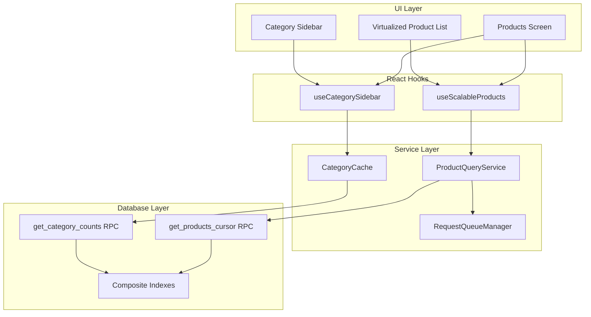
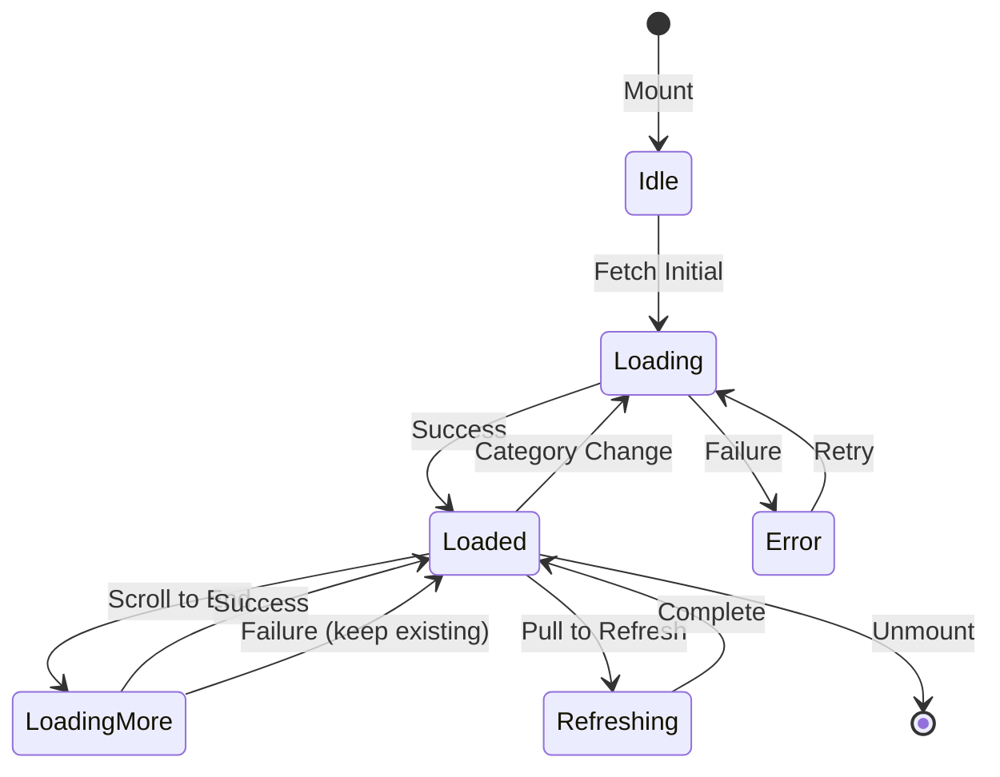

# Design Document: Scalable Product Loading System

## Overview

This design implements a scalable product loading system for the DukaaOn app that can handle 10,000+ products with sub-second loading times. The current implementation suffers from:

1. **Double queries** - Each request runs COUNT(*) + SELECT
2. **Offset pagination** - Gets slower as offset increases (O(n))
3. **Client-side filtering** - Fetches all products, filters in JS
4. **No request cancellation** - Stale requests complete and update UI
5. **Inefficient search** - ILIKE with leading wildcard can't use indexes

### Target Architecture

```
┌─────────────────────────────────────────────────────────────────┐
│                        Products Screen                          │
├─────────────────────────────────────────────────────────────────┤
│  ┌──────────────┐    ┌────────────────────────────────────────┐ │
│  │   Category   │    │         Virtualized Product List       │ │
│  │   Sidebar    │    │  ┌─────┐ ┌─────┐ ┌─────┐ ┌─────┐      │ │
│  │              │    │  │ P1  │ │ P2  │ │ P3  │ │ P4  │      │ │
│  │  [All] (150) │    │  └─────┘ └─────┘ └─────┘ └─────┘      │ │
│  │  [Cat1] (50) │    │  ┌─────┐ ┌─────┐ ┌─────┐ ┌─────┐      │ │
│  │  [Cat2] (30) │    │  │ P5  │ │ P6  │ │ P7  │ │ P8  │      │ │
│  │  [Cat3] (70) │    │  └─────┘ └─────┘ └─────┘ └─────┘      │ │
│  │              │    │         ... (only visible rendered)    │ │
│  └──────────────┘    └────────────────────────────────────────┘ │
└─────────────────────────────────────────────────────────────────┘
                              │
                              ▼
┌─────────────────────────────────────────────────────────────────┐
│                    useScalableProducts Hook                     │
│  - Cursor-based pagination                                      │
│  - Request deduplication & cancellation                         │
│  - Adaptive batch sizing                                        │
└─────────────────────────────────────────────────────────────────┘
                              │
                              ▼
┌─────────────────────────────────────────────────────────────────┐
│                   ProductQueryService                           │
│  - Cache management (by category + cursor)                      │
│  - Background revalidation                                      │
│  - Request queue management                                     │
└─────────────────────────────────────────────────────────────────┘
                              │
                              ▼
┌─────────────────────────────────────────────────────────────────┐
│              Supabase RPC: get_products_cursor                  │
│  - Single query (no COUNT)                                      │
│  - Cursor-based pagination (WHERE id > cursor)                  │
│  - Server-side filtering (category, subcategory, search)        │
│  - Returns has_more flag                                        │
└─────────────────────────────────────────────────────────────────┘
```

## Architecture



## Components and Interfaces

### 1. Database: Cursor-Based RPC Function

```sql
-- New optimized RPC function with cursor pagination
CREATE OR REPLACE FUNCTION get_products_cursor(
  p_seller_id uuid,
  p_category text DEFAULT NULL,
  p_subcategory text DEFAULT NULL,
  p_search_term text DEFAULT NULL,
  p_cursor uuid DEFAULT NULL,
  p_limit integer DEFAULT 20
)
RETURNS TABLE (
  id uuid,
  name text,
  category text,
  subcategory text,
  image_url text,
  price numeric,
  min_quantity integer,
  unit text,
  has_more boolean
)
LANGUAGE plpgsql
SECURITY DEFINER
AS $$
BEGIN
  RETURN QUERY
  WITH filtered_products AS (
    SELECT 
      p.id,
      p.name,
      p.category,
      p.subcategory,
      p.image_url,
      p.price,
      p.min_quantity,
      p.unit
    FROM products p
    WHERE 
      p.seller_id = p_seller_id
      AND (p_category IS NULL OR p.category = p_category)
      AND (p_subcategory IS NULL OR p.subcategory = p_subcategory)
      AND (p_cursor IS NULL OR p.id > p_cursor)
      AND (p_search_term IS NULL OR p.search_vector @@ plainto_tsquery('english', p_search_term))
    ORDER BY p.id
    LIMIT p_limit + 1  -- Fetch one extra to determine has_more
  )
  SELECT 
    fp.id,
    fp.name,
    fp.category,
    fp.subcategory,
    fp.image_url,
    fp.price,
    fp.min_quantity,
    fp.unit,
    (SELECT COUNT(*) > p_limit FROM filtered_products) as has_more
  FROM filtered_products fp
  LIMIT p_limit;
END;
$$;
```

### 2. ProductQueryService

```typescript
// services/products/ProductQueryService.ts

interface CursorPaginationParams {
  sellerId: string;
  category?: string;
  subcategory?: string;
  searchTerm?: string;
  cursor?: string;
  limit?: number;
}

interface CursorPaginationResult {
  products: Product[];
  nextCursor: string | null;
  hasMore: boolean;
  fromCache: boolean;
}

interface PendingRequest {
  promise: Promise<CursorPaginationResult>;
  abortController: AbortController;
  timestamp: number;
}

class ProductQueryService {
  private cache: Map<string, CursorPaginationResult>;
  private pendingRequests: Map<string, PendingRequest>;
  private cacheTimestamps: Map<string, number>;
  
  // Generate cache key from params
  private getCacheKey(params: CursorPaginationParams): string;
  
  // Fetch products with cursor pagination
  async fetchProducts(params: CursorPaginationParams): Promise<CursorPaginationResult>;
  
  // Cancel all pending requests for a seller/category
  cancelRequests(sellerId: string, category?: string): void;
  
  // Cancel all pending requests
  cancelAllRequests(): void;
  
  // Invalidate cache for a seller
  invalidateCache(sellerId: string): void;
  
  // Get from cache if available and fresh
  getFromCache(params: CursorPaginationParams): CursorPaginationResult | null;
  
  // Prefetch next batch
  prefetchNext(params: CursorPaginationParams, currentCursor: string): void;
}
```

### 3. RequestQueueManager

```typescript
// services/products/RequestQueueManager.ts

interface QueuedRequest {
  id: string;
  params: CursorPaginationParams;
  abortController: AbortController;
  resolve: (result: CursorPaginationResult) => void;
  reject: (error: Error) => void;
}

class RequestQueueManager {
  private queue: Map<string, QueuedRequest>;
  private inFlight: Map<string, Promise<CursorPaginationResult>>;
  
  // Add request to queue, deduplicate if same params
  enqueue(params: CursorPaginationParams): Promise<CursorPaginationResult>;
  
  // Cancel request by ID
  cancel(requestId: string): void;
  
  // Cancel all requests matching pattern
  cancelMatching(pattern: { sellerId?: string; category?: string }): void;
  
  // Check if request is in flight
  isInFlight(params: CursorPaginationParams): boolean;
  
  // Get pending request count
  getPendingCount(): number;
}
```

### 4. useScalableProducts Hook

```typescript
// hooks/useScalableProducts.ts

interface UseScalableProductsOptions {
  sellerId: string;
  category?: string;
  subcategory?: string;
  searchTerm?: string;
  batchSize?: number;
}

interface UseScalableProductsResult {
  products: Product[];
  isLoading: boolean;
  isLoadingMore: boolean;
  hasMore: boolean;
  error: string | null;
  loadMore: () => void;
  refresh: () => void;
  cacheStatus: 'hit' | 'miss' | 'stale';
}

function useScalableProducts(options: UseScalableProductsOptions): UseScalableProductsResult;
```

### 5. CategoryCache

```typescript
// services/cache/CategoryCache.ts

interface CategoryCount {
  category: string;
  count: number;
  subcategories?: { name: string; count: number }[];
}

class CategoryCache {
  private counts: Map<string, CategoryCount[]>;
  private lastUpdated: Map<string, number>;
  
  // Get category counts for a seller
  async getCategoryCounts(sellerId: string): Promise<CategoryCount[]>;
  
  // Refresh counts in background
  refreshInBackground(sellerId: string): void;
  
  // Invalidate counts for a seller
  invalidate(sellerId: string): void;
}
```

## Data Models

### Cache Key Structure

```typescript
// Cache key format for cursor-based pagination
type CacheKey = `products_${sellerId}_${category}_${subcategory}_${cursor}`;

function generateCacheKey(params: CursorPaginationParams): string {
  const parts = [
    'products',
    params.sellerId,
    params.category || 'all',
    params.subcategory || 'all',
    params.cursor || 'start',
  ];
  return parts.join('_');
}
```

### Request State

```typescript
interface RequestState {
  id: string;
  status: 'pending' | 'in-flight' | 'completed' | 'cancelled';
  params: CursorPaginationParams;
  startTime: number;
  endTime?: number;
  error?: string;
}
```

## Correctness Properties

*A property is a characteristic or behavior that should hold true across all valid executions of a system-essentially, a formal statement about what the system should do. Properties serve as the bridge between human-readable specifications and machine-verifiable correctness guarantees.*

### Property 1: Cursor Ordering Consistency
*For any* cursor value and product result set, all returned products SHALL have IDs greater than the cursor value, ensuring no duplicates or missed items during pagination.
**Validates: Requirements 1.1, 1.2**

### Property 2: Filter Correctness
*For any* category and/or subcategory filter, all returned products SHALL match the specified filter criteria exactly.
**Validates: Requirements 2.1, 2.2**

### Property 3: Has-More Flag Accuracy
*For any* paginated result, the has_more flag SHALL be true if and only if there exist more products matching the query after the current result set.
**Validates: Requirements 1.4, 3.5**

### Property 4: Request Cancellation on Filter Change
*For any* category change, all pending requests for the previous category SHALL be cancelled before the new request is initiated.
**Validates: Requirements 2.4, 5.2**

### Property 5: Request Deduplication
*For any* set of concurrent identical requests (same params), only one network call SHALL be made and all callers SHALL receive the same result.
**Validates: Requirements 5.1**

### Property 6: Cleanup on Unmount
*For any* component unmount, all pending requests SHALL be cancelled and their responses SHALL not update state.
**Validates: Requirements 5.4, 5.5**

### Property 7: Virtualization Render Bounds
*For any* scroll position, the number of rendered product items SHALL not exceed visible items plus the configured buffer size (default 10 above + 10 below).
**Validates: Requirements 6.1**

### Property 8: Prefetch Trigger Threshold
*For any* scroll position at or beyond 80% of loaded content, a prefetch for the next batch SHALL be triggered if not already in progress.
**Validates: Requirements 7.2, 7.3**

### Property 9: Adaptive Batch Sizing
*For any* slow network condition (2G/3G), the batch size SHALL be reduced to 10 products; for fast networks, the batch size SHALL be 20 products.
**Validates: Requirements 7.5, 10.4**

### Property 10: Cache Key Uniqueness
*For any* combination of (sellerId, category, subcategory, cursor), the generated cache key SHALL be unique and deterministic.
**Validates: Requirements 8.1**

### Property 11: Cache-First with Stale Revalidation
*For any* cached data older than 5 minutes, the system SHALL return cached data immediately AND trigger a background refresh.
**Validates: Requirements 8.2, 8.3**

### Property 12: Cache Invalidation by Seller
*For any* seller cache invalidation, all cache entries for that seller (across all categories and cursors) SHALL be removed.
**Validates: Requirements 8.5**

### Property 13: Search Debounce
*For any* sequence of rapid keystrokes within 300ms, only one search request SHALL be made after the debounce period.
**Validates: Requirements 9.2**

### Property 14: Search with Category Filter
*For any* search within a category, all returned products SHALL match both the search term AND the category filter.
**Validates: Requirements 9.4**

## Error Handling

### Network Failures
1. **Initial Load Failure**: Show error state with retry button
2. **Load More Failure**: Show inline error with retry, keep existing products
3. **Background Refresh Failure**: Silently log, keep stale data

### Invalid Cursor
1. **Cursor Not Found**: Reset to beginning, log warning
2. **Malformed Cursor**: Reset to beginning, log error

### Cache Errors
1. **Cache Read Error**: Fall back to network
2. **Cache Write Error**: Log error, continue without caching
3. **Cache Size Exceeded**: Evict LRU entries

### State Transitions



## Testing Strategy

### Dual Testing Approach

This feature requires both unit tests and property-based tests:

- **Unit tests**: Verify specific examples, edge cases, and integration points
- **Property-based tests**: Verify universal properties hold across all inputs

### Property-Based Testing Framework

We will use **fast-check** for property-based testing in TypeScript/JavaScript.

```typescript
import fc from 'fast-check';
```

### Test Categories

#### 1. Cursor Pagination Tests
- Property tests for cursor ordering
- Property tests for has_more accuracy
- Unit tests for edge cases (empty results, single item)

#### 2. Filter Tests
- Property tests for category/subcategory filtering
- Property tests for search + category combination
- Unit tests for "All" category behavior

#### 3. Request Management Tests
- Property tests for deduplication
- Property tests for cancellation
- Unit tests for race conditions

#### 4. Cache Tests
- Property tests for cache key uniqueness
- Property tests for stale-while-revalidate
- Property tests for LRU eviction
- Unit tests for invalidation

#### 5. Adaptive Behavior Tests
- Property tests for batch size adaptation
- Property tests for prefetch triggering

### Test Annotations

Each property-based test MUST be annotated with:
```typescript
/**
 * **Feature: scalable-product-loading, Property {number}: {property_text}**
 * **Validates: Requirements {X.Y}**
 */
```

### Minimum Iterations

Each property-based test should run a minimum of 100 iterations to ensure adequate coverage of the input space.

## Database Migration

### Required Indexes

```sql
-- Composite index for cursor pagination with filters
CREATE INDEX idx_products_seller_category_id 
ON products(seller_id, category, id);

-- Composite index for subcategory filtering
CREATE INDEX idx_products_seller_category_subcategory_id 
ON products(seller_id, category, subcategory, id);

-- Full-text search index
ALTER TABLE products ADD COLUMN IF NOT EXISTS search_vector tsvector;
CREATE INDEX idx_products_search ON products USING gin(search_vector);

-- Trigger to update search vector
CREATE OR REPLACE FUNCTION products_search_vector_update() RETURNS trigger AS $$
BEGIN
  NEW.search_vector := to_tsvector('english', coalesce(NEW.name, '') || ' ' || coalesce(NEW.brand, ''));
  RETURN NEW;
END;
$$ LANGUAGE plpgsql;

CREATE TRIGGER products_search_vector_trigger
BEFORE INSERT OR UPDATE ON products
FOR EACH ROW EXECUTE FUNCTION products_search_vector_update();
```

### Category Counts Materialized View

```sql
-- Materialized view for fast category counts
CREATE MATERIALIZED VIEW IF NOT EXISTS seller_category_counts AS
SELECT 
  seller_id,
  category,
  subcategory,
  COUNT(*) as product_count
FROM products
GROUP BY seller_id, category, subcategory;

CREATE UNIQUE INDEX idx_seller_category_counts 
ON seller_category_counts(seller_id, category, subcategory);

-- Refresh function (call periodically or on product changes)
CREATE OR REPLACE FUNCTION refresh_category_counts() RETURNS void AS $$
BEGIN
  REFRESH MATERIALIZED VIEW CONCURRENTLY seller_category_counts;
END;
$$ LANGUAGE plpgsql;
```
