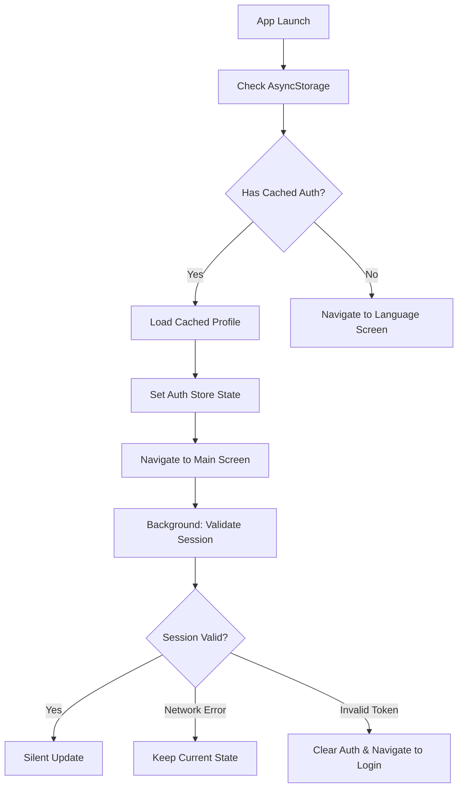
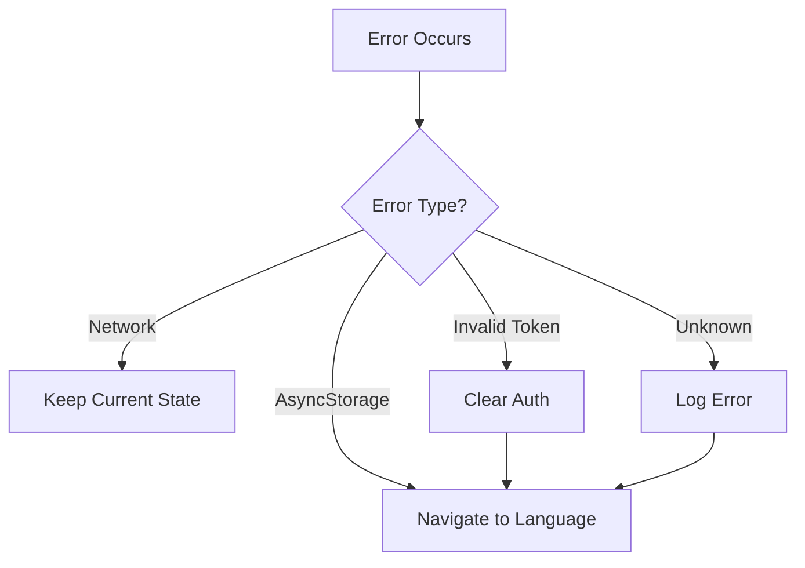

# Design Document: Simplify App Loading

## Overview

This design replaces the complex multi-layered app loading system with a simple, linear AsyncStorage-based approach. The current system has multiple competing services (ProfileLoader, AuthStateManager, DataFetchCoordinator), safety timeouts (30s, 15s), and race conditions that cause the app to hang on first launch.

The new design follows a simple principle: **trust the cache, validate in background**.

## Architecture



### Key Principles

1. **Single Source of Truth**: AsyncStorage holds the cached auth state
2. **Cache-First Navigation**: Navigate based on cache, don't wait for network
3. **Non-Blocking Validation**: Session validation happens after navigation
4. **Fail-Safe Fallback**: Any error leads to language screen, never infinite loading

## Components and Interfaces

### SimpleAuthLoader (New Service)

Replaces: ProfileLoader, AuthStateManager, authSync utilities

```typescript
interface SimpleAuthLoader {
  // Check cached auth and return navigation target
  checkCachedAuth(): Promise<{
    isAuthenticated: boolean;
    profile: Profile | null;
    navigateTo: '/(main)' | '/(auth)/language';
  }>;
  
  // Save auth data to cache
  cacheAuthData(profile: Profile, session: Session): Promise<void>;
  
  // Clear all cached auth data
  clearCachedAuth(): Promise<void>;
  
  // Background session validation (non-blocking)
  validateSessionInBackground(): void;
}
```

### Simplified Auth Store

The auth store becomes simpler with direct state management:

```typescript
interface SimplifiedAuthState {
  user: Profile | null;
  session: Session | null;
  loading: boolean;
  
  // Simple setters
  setUser(user: Profile | null): void;
  setSession(session: Session | null): void;
  setLoading(loading: boolean): void;
  
  // Clear all auth
  clearAuth(): Promise<void>;
}
```

### Simplified Index Component

The index.tsx becomes a simple decision point:

```typescript
// Pseudocode for simplified index.tsx
async function onMount() {
  const result = await SimpleAuthLoader.checkCachedAuth();
  
  if (result.isAuthenticated && result.profile) {
    authStore.setUser(result.profile);
    authStore.setLoading(false);
    router.replace('/(main)');
    
    // Non-blocking background validation
    SimpleAuthLoader.validateSessionInBackground();
  } else {
    authStore.setLoading(false);
    router.replace('/(auth)/language');
  }
}
```

## Data Models

### Cached Auth Data (AsyncStorage Keys)

```typescript
// Keys stored in AsyncStorage
const AUTH_KEYS = {
  AUTH_VERIFIED: 'auth_verified',      // 'true' | null
  USER_ID: 'user_id',                  // string UUID
  USER_PROFILE: 'user_profile',        // JSON stringified Profile
  SESSION_EXPIRY: 'session_expiry',    // ISO timestamp
};

// Profile structure (existing)
interface Profile {
  id: string;
  phone_number: string;
  role: 'retailer' | 'wholesaler' | 'manufacturer';
  status: string;
  business_details: object;
  seller_details?: object;
  created_at: string;
  updated_at: string;
}
```

## Correctness Properties

*A property is a characteristic or behavior that should hold true across all valid executions of a system-essentially, a formal statement about what the system should do. Properties serve as the bridge between human-readable specifications and machine-verifiable correctness guarantees.*

### Property 1: Navigation timing with cached auth
*For any* valid cached auth state (auth_verified='true' and user_id exists), the app SHALL navigate to the main screen within 1 second of launch.
**Validates: Requirements 1.1, 1.2, 5.2**

### Property 2: Navigation timing without cached auth
*For any* empty or invalid cached auth state, the app SHALL navigate to the language screen within 500ms of launch.
**Validates: Requirements 1.3, 5.1**

### Property 3: Profile data synchronous availability
*For any* navigation to the main screen with cached profile, the profile data SHALL be available in the auth store before home screen components mount.
**Validates: Requirements 2.1, 2.2**

### Property 4: Profile cache update timing
*For any* profile data change, AsyncStorage SHALL be updated within 1 second of the change.
**Validates: Requirements 2.3**

### Property 5: Background validation non-blocking
*For any* app launch with cached auth, navigation to main screen SHALL complete before session validation network request completes.
**Validates: Requirements 3.1, 3.3**

### Property 6: Definitive logout only
*For any* background validation failure, logout SHALL only occur if the error indicates an invalid/expired token, not for network errors.
**Validates: Requirements 3.2**

### Property 7: Error fallback navigation
*For any* error during the loading process, the app SHALL navigate to the language screen within 2 seconds rather than showing infinite loading.
**Validates: Requirements 5.3**

### Property 8: Maximum splash duration
*For any* app launch scenario, the splash screen SHALL be displayed for no longer than 2 seconds.
**Validates: Requirements 1.4**

## Error Handling

### Error Categories

1. **AsyncStorage Errors**: Treat as no cached auth, navigate to language screen
2. **Network Errors**: Keep current cached state, don't logout
3. **Invalid Token Errors**: Clear auth and navigate to language screen
4. **Unknown Errors**: Log and navigate to language screen

### Error Recovery Flow



## Testing Strategy

### Dual Testing Approach

This feature uses both unit tests and property-based tests:

- **Unit tests**: Verify specific scenarios like empty cache, valid cache, network errors
- **Property-based tests**: Verify timing guarantees and state invariants across many random inputs

### Property-Based Testing

Library: **fast-check** (already in project dependencies)

Each property-based test will:
1. Generate random auth states (cached/not cached, valid/invalid profiles)
2. Mock AsyncStorage and network responses
3. Verify the property holds across 100+ iterations
4. Tag with format: `**Feature: simplify-app-loading, Property {number}: {property_text}**`

### Test Categories

1. **Cache Check Tests**: Verify AsyncStorage reads are fast and correct
2. **Navigation Timing Tests**: Verify navigation happens within time bounds
3. **Background Validation Tests**: Verify validation doesn't block navigation
4. **Error Handling Tests**: Verify fallback behavior on various errors

### Key Test Scenarios

1. Fresh install (no cache) → Language screen < 500ms
2. Valid cached auth → Main screen < 1s
3. Corrupted cache → Language screen < 2s
4. Network timeout during validation → Keep cached state
5. Invalid token during validation → Clear auth, language screen
